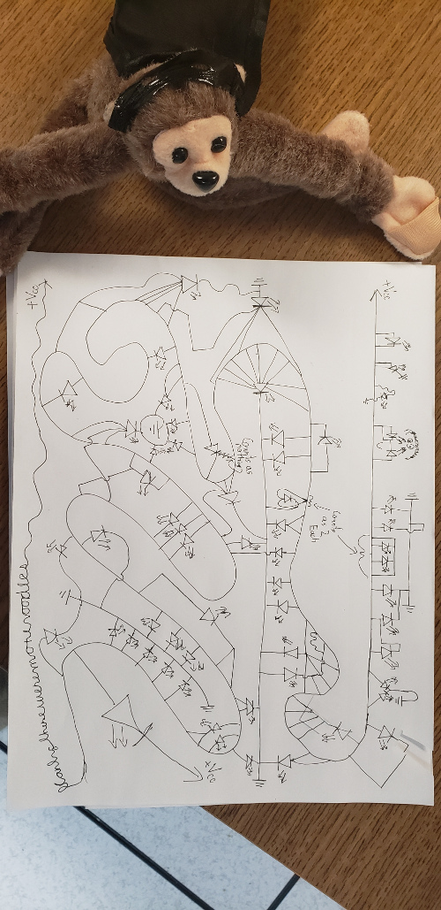

# Short\_circuit

In this challenge, you were given the following image:

Looking closer at it, you can see that it is a funny-looking circuit diagram with some power sources, grounds, and LEDs. If you rotate the image and follow the wire from the green dot, and mark the branching arrows with "1" if it causes an LED to turn on, and "0" if it does not, you end up with the following image. I've added some red lines to determine when a character ends and another begins.

If you run the sequence of binary digits that you get through a binary-to-text translator, you get the flag.

flag{owmyhand}
