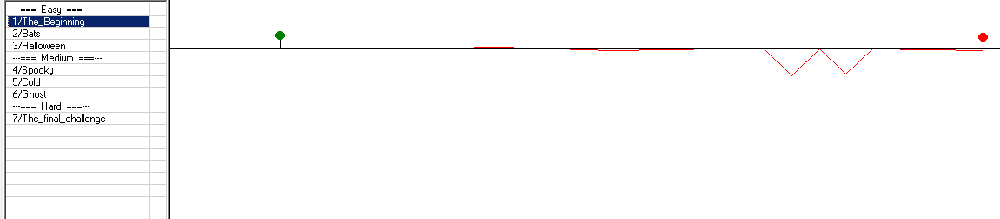

## Nostalgia (500 pts) (Recon)
``` 
Update:
It's a game. Play all LEVELS and get the flag

Hint2: My mapeditor didn't allow me to create certain letters.. Luckily I have a awesome regex for you!

---------
I remember this like it was yesterday. Nostalgia ftw!!
Flag format is BTH_CTF{md5(???)} where ??? is /[A-Z\^]/
Also I think the filename is wrong... Luckily the extension is correct 

Given: a file named data.mrg
```

The given `.mrg` is a levels file from a game called Gravity defied. Opening it in a [map editor](http://gdtr.net/handbook/tools/) (or spending a very frustrating 30 minutes playing the game) reveales that the tracks are in fact in the shape of letters. 



Taking the first (also the only) uppercase letter or `^` as per the regex gives `WYVNM^U`, the MD5 of that is `0d4a1d9c7ec5a9568a6c2a1c4a765111` giving the flag `BTH_CTF{0d4a1d9c7ec5a9568a6c2a1c4a765111}`
