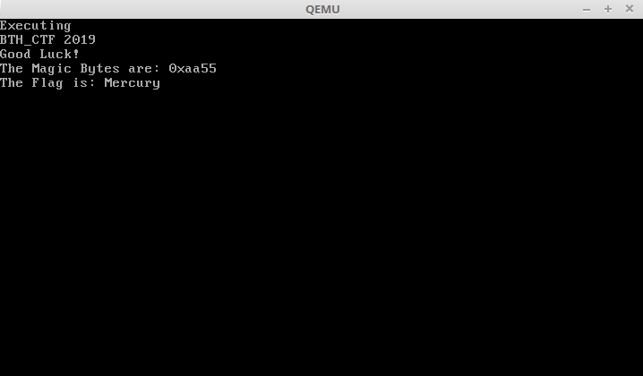

## What is Hidden (488 pts) (Misc)
```I think there is something more with this PDF, can you find it?
Wrap the found flag in BTH_CTF{}

given: a .pdf file named Web.pdf```

Running `file` file on the PDf reveals that it is also a DOS/MBR boot sector.
If we open the file in qemu with `qemu-system-i386 Web.pdf` and press any key, we see the flag:


